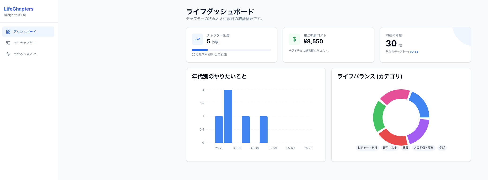

# LifeChapters

[](https://github.com/yminamiyama/life-chapters/actions/workflows/ci.yml)

> **Note**  
> 本プロダクトの正式名称は **LifeChapters** です。  
> 開発プロジェクトのコードネームおよび内部ドメインモデルには着想元のコンセプトに基づき **TimeBucket** を使用しています。  
> - Product Name: **LifeChapters**  
> - Internal Code Name: `TimeBucket`

**「人生の残り時間」を可視化し、経験の配当を最大化するライフプランニング・アプリ**  
書籍『Die With Zero』にインスパイアされ、人生を「チャプター（5–10年の期間）」で区切って計画・実行・振り返りを行うツールです。デモモード（ログイン不要）で即体験できます。

**[ 🚀 デモを試す (Try Demo Mode) ](https://life-chapters.yminamiyama.com/?demo=1)**  
*(ワンクリックでダミーデータによる動作確認が可能です)*

---

## 📸 スクリーンショット
<p align="center">
  
</p>

## 🛠 技術スタックと選定理由
- **Frontend: Next.js 16 (App Router)**  
  - Server/Client Components の分離で初期表示を最適化。  
  - **SWR** による楽観的更新でモバイル回線でも軽快。
- **Backend: Rails 8 (API Mode)**  
  - 使い慣れたエコシステムで開発速度と安定性を両立。  
  - `solid_queue` / `solid_cache` により DB 集約でシンプルにスケール。
- **Auth: Google OAuth + HttpOnly Cookie**  
  - セキュリティと UX のバランス重視でクッキーセッション採用。
- **Infra: Vercel + Render**  
  - コストと運用負荷を抑えつつ、環境変数でデモ/本番を即切替。  

## 🏗 アーキテクチャのこだわり
1. **ドメインとブランドを疎結合に**  
   内部モデルは TimeBucket、UI は LifeChapters として表現し、リネームやピボットにも強い設計にしています。
2. **モバイル実用 UX**  
   - 横スクロールのチャプターリスト + FAB（セーフエリア考慮）で片手操作を最適化。  
   - デモバナー位置をデバイス別に調整し、下部タブとの衝突を回避。  
3. **API の将来互換性**  
   - エンドポイントを `/v1` でバージョニング。  
   - フロント/バックエンドを別ドメイン運用し、CORS と Cookie の挙動を明示管理。  

## 主要機能
- チャプター管理（5y/10y）、ポジション順ソート
- アイテム管理: タイトル / 価値観 (value_statement) / 詳細メモ / カテゴリ / 難易度 / リスク / コスト / 目標年 / タグ、ステータス更新
- ダッシュボード: 完了率・カテゴリ分布・年代別密度・生涯コスト
- デモモード: `?demo=1` または「デモモードで見る」ボタンでログイン不要体験

## 🚀 セットアップ（ローカル開発）
```bash
# frontend
cp frontend/.env.example frontend/.env.local
pnpm install && pnpm dev

# backend
cd backend
cp .env.example .env
bundle install
bin/rails db:setup && bin/rails s
```
主要環境変数:
- `NEXT_PUBLIC_BACKEND_URL` (例: http://localhost:4000)
- `NEXT_PUBLIC_API_BASE_URL` (例: http://localhost:4000/v1)
- `NEXT_PUBLIC_USE_MOCK`（デモ強制 true/false）
- `FRONTEND_URL` (Render, カンマ区切りで許可オリジン)

## 🧪 テスト・品質管理
- Frontend: `pnpm lint`, `pnpm tsc --noEmit`
- Backend: `bundle exec rspec`
- CI: GitHub Actions で lint / test を自動実行

## 🌐 デプロイ
- Frontend: Vercel（環境変数で API エンドポイント切替）
- Backend: Render（`FRONTEND_URL` 設定 + `postDeploy` で `rails db:migrate`）

## 最近の改善例
- API パスを `/v1` に刷新し、Swagger・リクエストスペックを同期
- デモモード導線を追加し、バナー位置をモバイル/PC で干渉しないよう最適化
- アイテムの詳細メモを独立フィールドとして保存・表示

## 👥 訪問者の方へ
- **価値提供までの設計**: オンボーディング短縮のため、デモモードで即体験可能にしました。  
- **実運用を想定したドメイン分離**: コードネームとブランド名を分け、CORS/セッションの挙動を明示的に管理。  
- **最新技術キャッチアップ**: Rails 8 / Next 16 を採用し、モダンな開発体験と長期保守性を両立。  

詳細なコードレビューや設計意図へのご質問は、お気軽にお知らせください。
